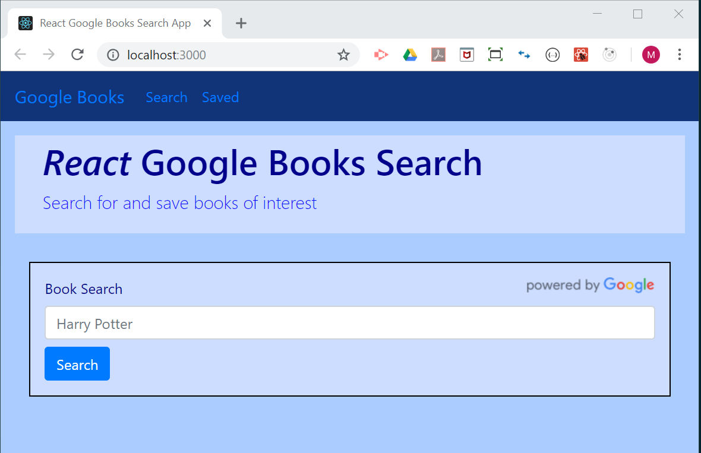
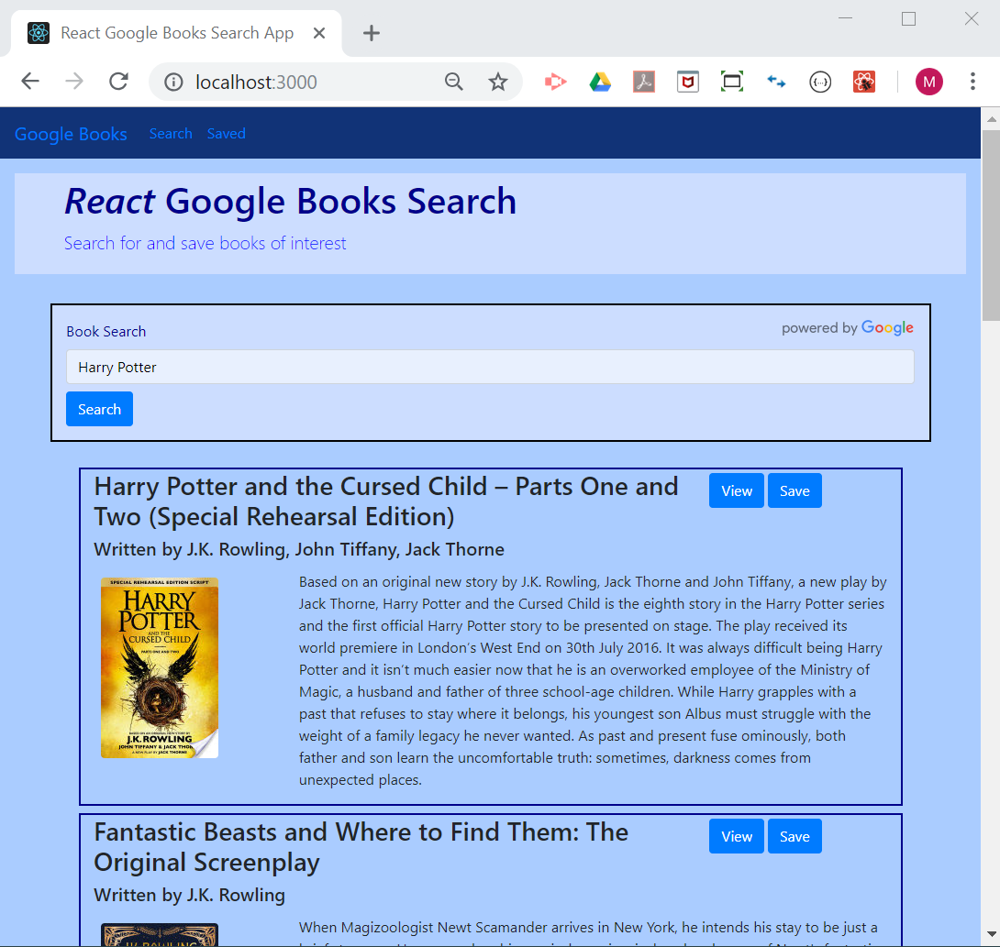
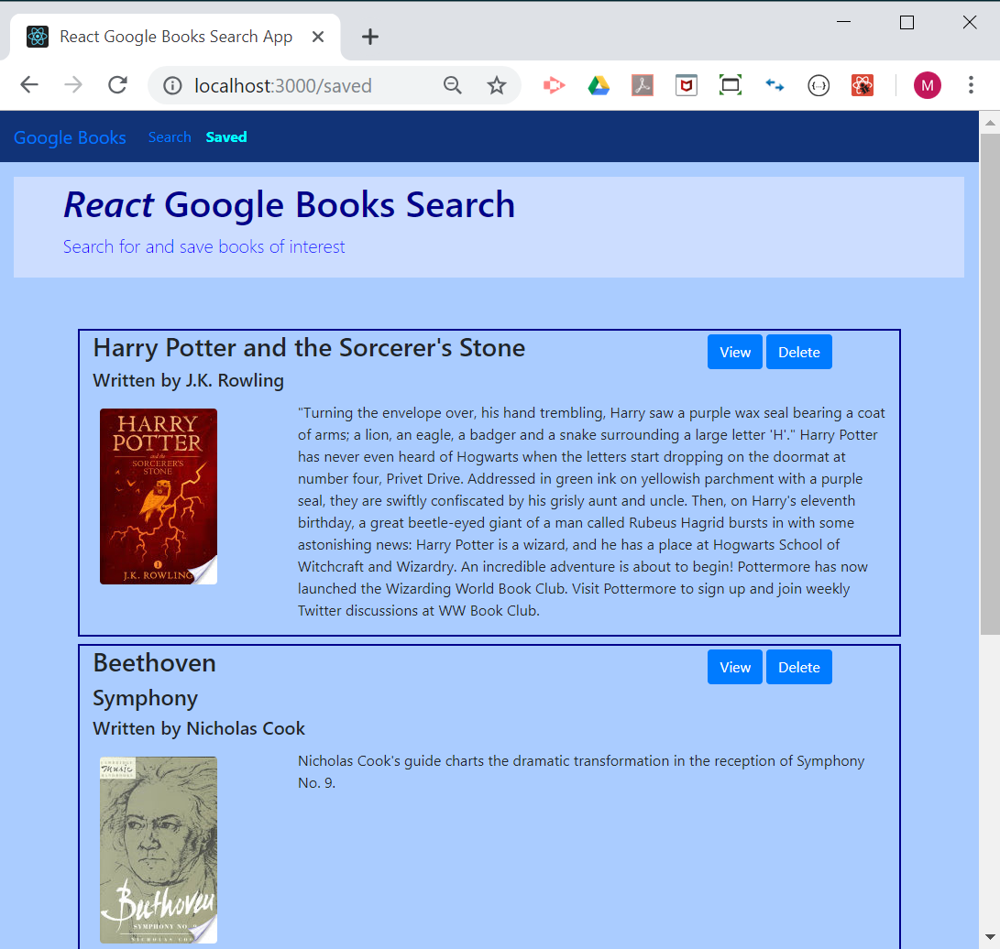

# *React* Google Books Search

### Overview

* This is a React-based Google Books Search full stack app, utilizing Node.js, Express, and MongoDB(mongoose).

* Two main pages for users:
    1. Search books through Google Books
    1. Save and view saved book information
     
## Objectives

* Utilize React lifecycle methods to query and display books based on user searches
* Also make use of Node.js, Express and MongoDB by developing full stack web app. 

### Deployment and Availability

* Heroku
  * Live app - https://shielded-wave-16938.herokuapp.com/
* GitHub
  * Repository - https://github.com/mmakino/Google-Books-Search

### Directories & Files
```
Google-Books-Search
├── client                        <= All Frontend React related files
│   ├── public                       under this "client" subdirectory
│   │   ├── images
│   │   │   └── powered_by_google_on_white.png
│   │   ├── favicon.ico
│   │   ├── index.html            -- Main frontend html page
│   │   └── manifest.json
│   ├── src
│   │   ├── components
│   │   │   ├── Saved
│   │   │   │   └── index.js      -- Saved books page component
│   │   │   ├── Search
│   │   │   │   ├── Input.css     
│   │   │   │   ├── Input.js      -- Search input form
│   │   │   │   └── index.js      -- Search books page component
│   │   │   ├── common
│   │   │   │   ├── Book.css      -- single book info component
│   │   │   │   ├── Book.js
│   │   │   │   └── Books.js      -- collections of book info
│   │   │   └── layout
│   │   │       ├── Header.css
│   │   │       ├── Header.js     -- Jumbotron header/banner
│   │   │       ├── Navbar.css
│   │   │       └── Navbar.js     -- Navbar at top
│   │   ├── App.css
│   │   ├── App.js                -- React main app javascript
│   │   ├── App.test.js
│   │   ├── index.css
│   │   ├── index.js
│   │   └── serviceWorker.js
│   ├── README-React.md
│   ├── package-lock.json
│   └── package.json
├── config
│   └── keys.js                   -- URI's for mongoose, google
├── models
│   ├── Book.js                   -- database schema
│   └── index.js                  -- bulk schema loader
├── routes
│   └── api                       -- backend routes API
│       └── books
│           ├── index.js          -- GET, POST, DELETE /api/books
│           └── search.js         -- GET /api/books/search?q=<book>
├── README.md
├── package-lock.json
├── package.json
└── server.js                     -- Backend Express web & MongoDB servers

14 directories, 33 files
```

### Intallation

* This full stack app can also be installed __locally__ through the following steps 

1. Clone the git repository
    ```
    git clone https://github.com/mmakino/Google-Books-Search.git
    ```
1. Install necessary packages
    ```
    npm install
    ```
    * This app uses the following NPM packages:
    ```
    "axios": "^0.18.0",
    "concurrently": "^4.1.0",
    "dotenv": "^7.0.0",
    "express": "^4.16.4",
    "mongoose": "^5.4.19"
    ```
1. Google Book API KEY
    In the root directory, `.env` file needs to include your own Google Books API key assigned to the `GOOGLE_BOOKS_API_KEY` environment variable.
    ```
    GOOGLE_BOOKS_API_KEY=<your Google Books API key>
    ```
1. MongoDB database
    * MongoDB server `mongod` needs to be up and running with all CRUD privileges.
    * `config/keys.js` includes the default local setup
       * mongodb://localhost/googlebooks
    * Models/Schema 
        ```
        models
        ├── Book.js
        └── index.js
        ```
1. Additionally, `nodemon` needs to be intalled locally with global setting.
    * `nodemon` can be installed by the following command
    ```
    npm install -g nodemon
    ```
1. Start the `local development` web server

    ```
    npm run devenv
    ```
    * It should display messages similar to the followings when the server has started successfully.
    ```
    moto@esb:~/github/Google-Books-Search (master *)$ npm run devenv

    > google-books-search@0.9.0 devenv /mnt/c/Users/mmaki/github/Google-Books-Search
    > concurrently 'npm run server' 'npm run client'

    [0]
    [0] > google-books-search@0.9.0 server /mnt/c/Users/mmaki/github/Google-Books-Search
    [0] > nodemon server.js
    [0]
    [1]
    [1] > google-books-search@0.9.0 client /mnt/c/Users/mmaki/github/Google-Books-Search
    [1] > npm start --prefix client
    [1]
    [0] [nodemon] 1.18.10
    [0] [nodemon] to restart at any time, enter `rs`
    [0] [nodemon] watching: *.*
    [0] [nodemon] starting `node server.js`
    [1]
    [1] > client@0.1.0 start /mnt/c/Users/mmaki/github/Google-Books-Search/client
    [1] > react-scripts start
    [1]
    [0] The server is running on port 3001
    [0] Connected to MongoDB mongodb://localhost/googlebooks
    [1] Starting the development server...
    [1]      ```
    1. Open the web page in a browser by entering the following URL into the address bar.
    ```
1. The web page should be automatically opened in a browser. In case it doesn't, please enter `http://localhost:3000` in the browswer's address bar.

### Example / Demo

* The main page with `search` interface.

   [](https://shielded-wave-16938.herokuapp.com/)

* Example search results with the search word "Harry Potter"

   [](https://shielded-wave-16938.herokuapp.com/)

* The `View` button will open the book information on a new tab at the external Google Books web site. 

* Pressing the `Save` button of each article will save the article in the internal database. 

* The `Saved` button on the navbar on top shows all `Saved` books.

   [](https://shielded-wave-16938.herokuapp.com/)

* Pressing the `Delete` button will removed the saved book entry from the internal database.


#### Written by [Motohiko Makino](https://mmakino.github.io/)

